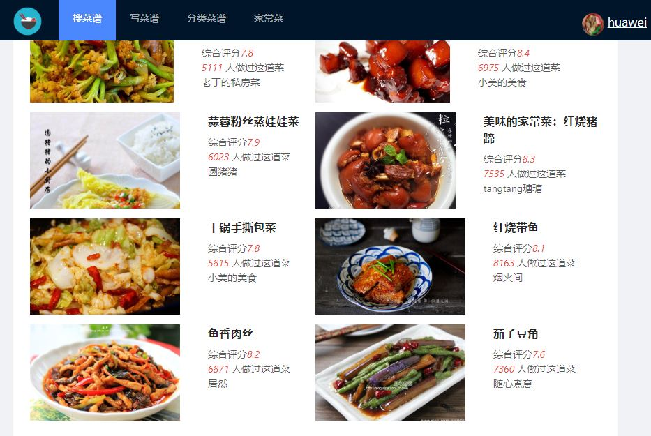

菜谱展示系统
====

本系统以美食菜谱为核心，包括的主要功能有
- 菜谱的搜索
- 菜谱的浏览
- 菜谱的创建
- 菜谱的收藏分享。

features
-----------
由于系统采用了*React技术栈*，可以实现局部更新而不必完全重载整个网页，这样系统的加载速度会更高，有助于提高用户体验。在后台服务器的选择上，本项目使用了基于*Node.js的Express框架*，Express的特点是简洁而灵活，有丰富的API和各种HTTP工具，可用于创建各种Web应用。

数据库使用了**MongoDB**，MongoDB可用于存储大容量的数据，例如文本和图片，但灵活性要比MySQL低。 

在每个菜谱的下方，用户可以进行评分和贴标签。系统还实现了智能推荐，主要根据用户的浏览记录和搜索记录，给用户推荐相似的菜谱。管理员的功能包括菜谱的添加删除，用户的管理等。 

系统截图
-----------
**主页图片**

**菜谱图片**

**详细菜谱**

